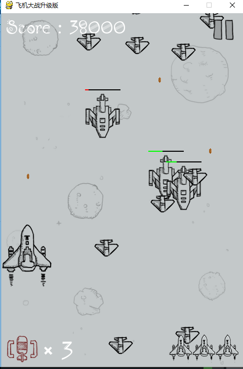
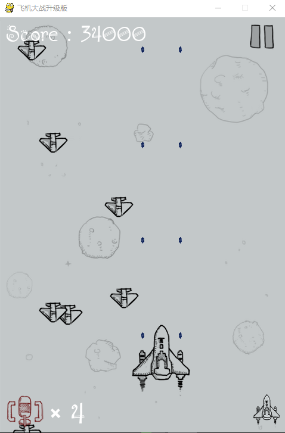
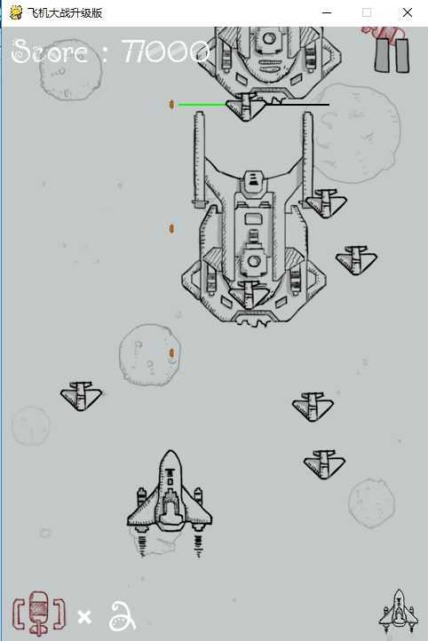
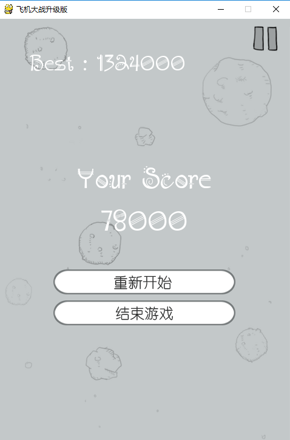

# PlaneBattle
- 使用pygame模块进行整个游戏的开发

# 游戏基本设定
- 游戏开始会播放音效
- 右上角可控制游戏的暂停，暂停时游戏界面清空防止玩家观察
- 地方共有大中小三种敌方飞机，分为高中低三种速度
- 子弹的射程为屏幕长度的80%
- 消灭大中小飞机非别需要20，8、1发子弹，得分分别为10000，6000，1000分
- 每30秒有随机道具补给，分为全屏炸弹和双倍子弹
- 炸弹最多存放3枚，双倍子弹可以持续18秒钟
- 游戏根据分数的增加逐步提高难度，表现为敌方飞机数量的增多和速度的加快
- 为敌机增加血槽显示，直观地看到敌机是否快被消灭
- 玩家有三次机会，每次被敌机消灭（与敌机发生碰撞），新诞生的时候会有3秒的安全期
- 游戏结束后会显示历史最高分数

# 开发思路
- 基于面向对象思想将整个游戏分为我方飞机、敌方飞机、子弹、供给四个模块
- 迭代式开发思想，完成整体游戏的流程，再逐步细化功能

# 游戏运行结果

